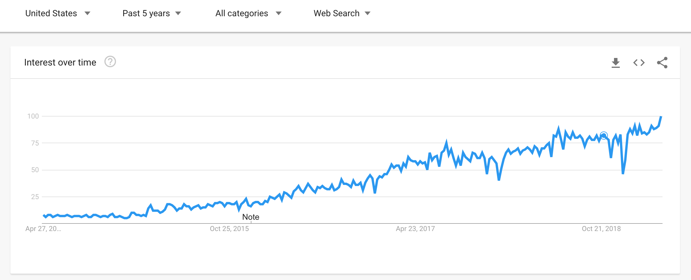

# About TypeScript 🎯

> TypeScript is an **open-source** programming language developed and maintained by **Microsoft**. It is a strict syntactical superset of JavaScript, and adds **optional** static typing to the language.

## History

> TypeScript was first made public in **October 2012** (at version 0.8), after two years of internal development at Microsoft.

> In July 2014, the development team announced a new TypeScript compiler, claiming 5× performance gains. Simultaneously, the source code, which was initially hosted on CodePlex, was **moved to GitHub**.

> On 22 September 2016, **TypeScript 2.0** was released; it introduced several features, including the ability for programmers to optionally prevent variables from being assigned null values, sometimes referred to as the billion-dollar mistake.



## Why?

> TypeScript originated from the **shortcomings of JavaScript** for the development of **large-scale applications** both at Microsoft and among their external customers. Challenges with dealing with complex JavaScript code led to demand for custom tooling to ease developing of components in the language.

## Key Features

Some of the key features we can highlight...

- ### Type Annotations

  > TypeScript provides static typing through type annotations to enable type checking at compile time. This is optional and can be ignored to use the regular dynamic typing of JavaScript.

  ```ts
  function add(a: number, b: number): number {
    return a + b;
  }
  ```

- ### Type Declarations

  ```ts
  type Priorities = 'High' | 'Medium' | 'Low';

  interface Bug {
      priority: Priorities;
      title: string;
      rank: number;
      isClosed: boolean;
      description?: string; // With `?`, this can be "string | undefined".
  }

  const bugCard: Bug = { ... };
  ```

  [Type vs Interface](https://github.com/Microsoft/TypeScript/blob/master/doc/spec.md#310-type-aliases)

- ### Class

  ```ts
  interface IStudent {
      ...
  }

  class Student implements IStudent {
      private name: string;
      private age: number;

      constructor(name: string, age: number, public gpa: number = 0.0) {
          this.name = name;
          this.age = age;
      }

      private toString(): string {
          return `Hi my name is ${this.name}, I am ${this.age} years old.`;
      }
  }
  ```

- ### Generics

  ```ts
  interface Array<T> {
    reverse(): T[];
    sort(compareFn?: (a: T, b: T) => number): T[];
  }

  interface NamedItem {
    name: string;
  }

  class List<T extends NamedItem> {
    next: List<T> = null;

    constructor(public item: T) {}

    insertAfter(item: T) {
      var temp = this.next;
      this.next = new List(item);
      this.next.next = temp;
    }

    log() {
      console.log(this.item.name);
    }

    // ...
  }
  ```

## Source

- [TypeScript Wiki](https://en.wikipedia.org/wiki/TypeScript)
- [TypeScript OpenSource Book (@basarat)](https://basarat.gitbooks.io/typescript/content/docs/getting-started.html)
- [Google Trend](https://trends.google.com/trends/explore?date=today%205-y&geo=US&q=%2Fm%2F0n50hxv)
- [Official TypeScript Spec Doc](https://github.com/Microsoft/TypeScript/blob/master/doc/spec.md)
- [Type vs Interface](https://stackoverflow.com/questions/37233735/typescript-interfaces-vs-types)
